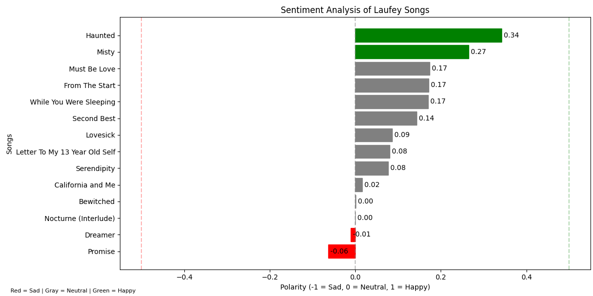

# social-media-data-analysis

for the execution of the project, you need to install the following libraries:

```bash
pip install textblob
pip install nltk
pip install requests
pip install python-dotenv
```
or you can use the requirements.txt file:

```bash
pip install -r requirements.txt
```
for validate the project, you need to create a .env file with the following variables:

```bash
clientID = your_client_id
client_Secret = your_client_secret]
```
to get your client id and client secret, you need to create an app in the Spotify Developer Dashboard(https://developer.spotify.com/dashboard/applications).

## Description: Extract and analyze data from a music platform like Spotify to understand trends and emotions



## functions

- data_collection.py: This script collects data from the Spotify API such as the artist's albums and tracks and after that, it searches for the lyrics of each of the songs listed in the album and then it saves the lyrics in a json file.
- sentiment_analysis.py: This script performs sentiment analysis on the collected data used the TextBlob library, after that it calculates the polarity of each sentiment.
- visualization.py: This script visualizes the sentiment analysis results.

in data_collection.py, you can change the `ARTIST_NAME` and `ALBUM_ID` variables to collect data from another artist and album.

to get the album id, you can search for the album in the Spotify Store (https://open.spotify.com/search) and you can search by the album name and artist name and after that you can take the id from the url for example: (https://open.spotify.com/intl-pt/album/`1rpCHilZQkw84A3Y9czvMO`).
